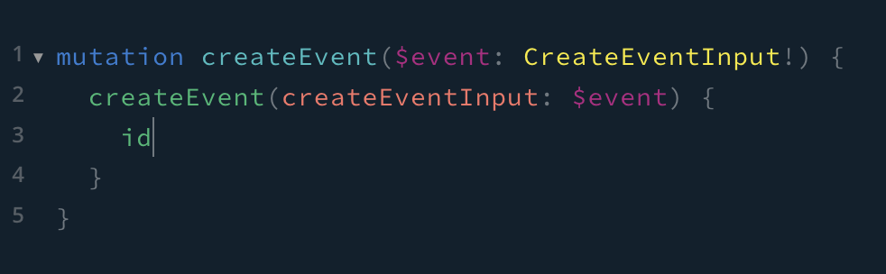

<p align="center">
  <b><h1>События</h1></b>
</p>

---

## Создать новое событие

```javascript
mutation createEvent($event: CreateEventInput!) {
  createEvent(createEventInput: $event) {
    id
  }
}
```

## Пример создания нового события в песочнице graphql



## Аргументы

```javascript
{
  "event": {
    "title": "событие",
    "desc": "описание события",
    "existTimeStart": "2023-09-27",
    "existTimeEnd": "2023-10-10",
    "whenStartToShow": "2023-09-26",
    "direction": "Festivals",
    "preview": "uploads/b0daf3c2-889a-4257-9e22-bd062660ed7d.jpg"
  }
}
```

## Пример аргументов в песочнице graphql


## Документация в песочнице graphql


---
