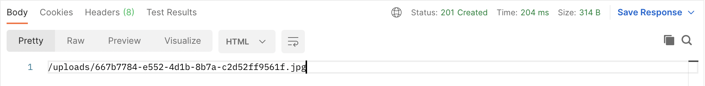
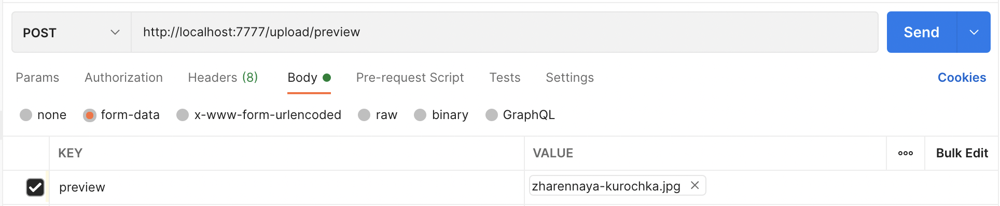
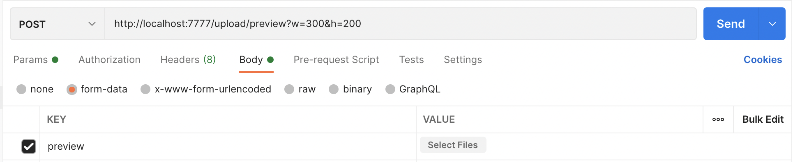
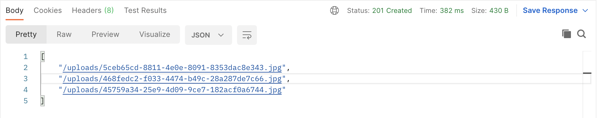
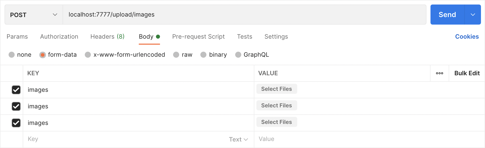

<p align="center">
  <b><h1>Сервер Cloud</h1></b>
</p>

### Загрузка превью изображения

```bash
#адрес для загрузки превью без query параметров (размер изображения 100х100px)
#метод отправки POST тело запроса form-data
$ localhost:7777/upload/preview

#адрес для загрузки превью с query параметрами (где w = ширина, h = высота)
#метод отправки POST тело запроса form-data
$ localhost:7777/upload/preview?w=300&h=200
```

### Ответ сервера

```
/uploads/667b7784-e552-4d1b-8b7a-c2d52ff9561f.jpg
```

### Пример ответа сервера в postman



### Пример загрузки превью изображения без query параметров в postman



### Пример загрузки превью изображения с query параметрами (где w = ширина, h = высота) в postman



---

### Загрузка нескольких изображений

```bash
#адрес для загрузки нескольких изображений
#метод отправки POST тело запроса form-data
$ localhost:7777/upload/images
```

### Ответ сервера

```
[
    "/uploads/5ceb65cd-8811-4e0e-8091-8353dac8e343.jpg",
    "/uploads/468fedc2-f033-4474-b49c-28a287de7c66.jpg",
    "/uploads/45759a34-25e9-4d09-9ce7-182acf0a6744.jpg"
]
```

### Пример ответа сервера в postman



### Пример загрузки нескольких изображений в postman



---
